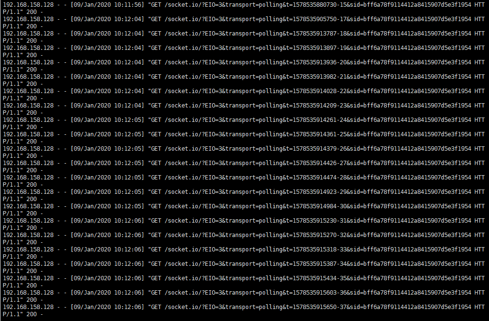
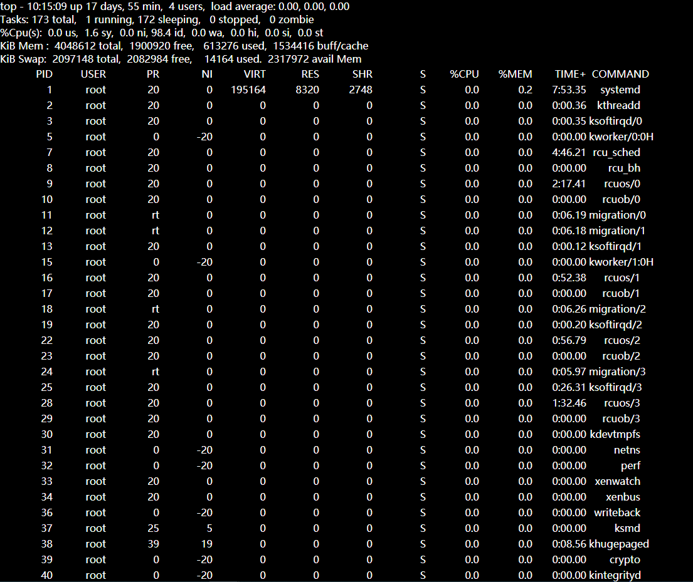

Realize the real-time display of tail and top commands on the server, and display the results on the web in real time

Tail limits the display length on the page and automatically scrolls to display the latest data

The tail page effect is as follows

  

The top page effect is as follows

  

